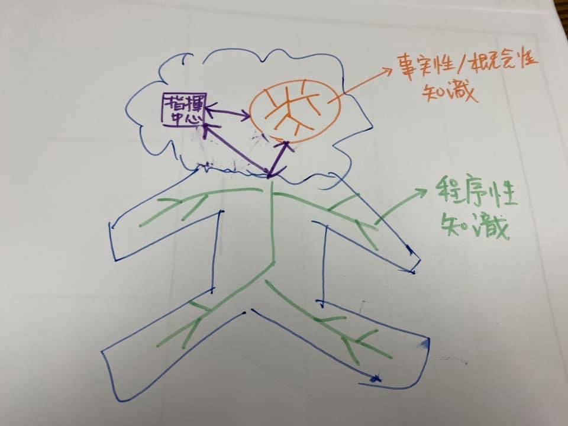
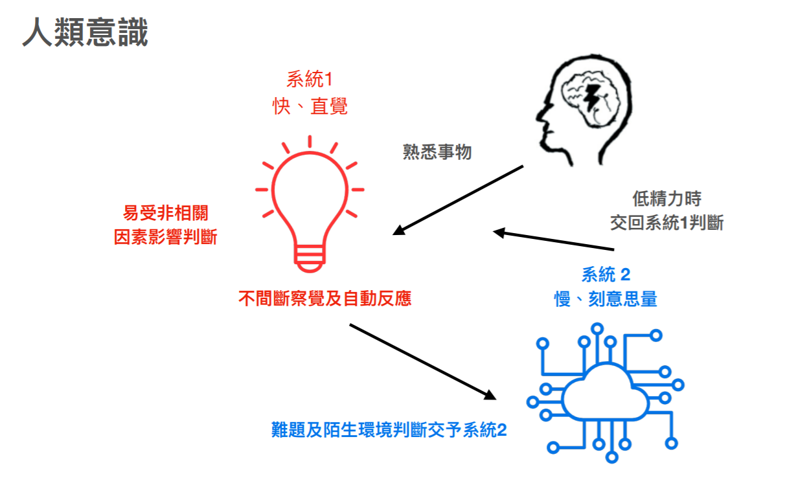
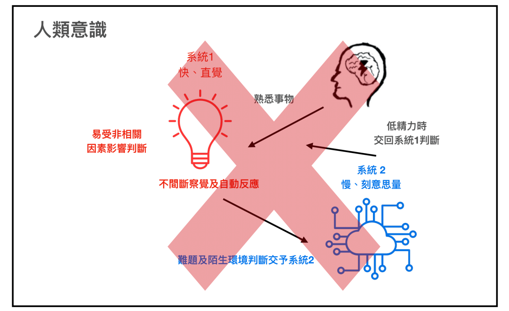
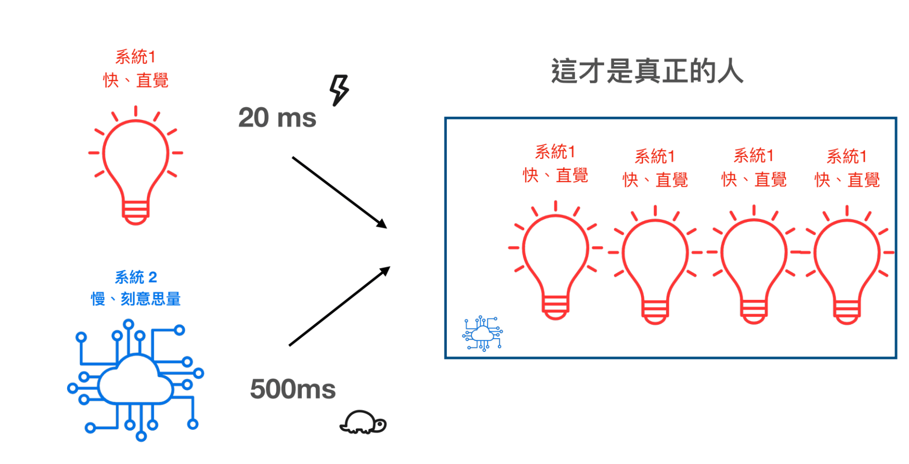
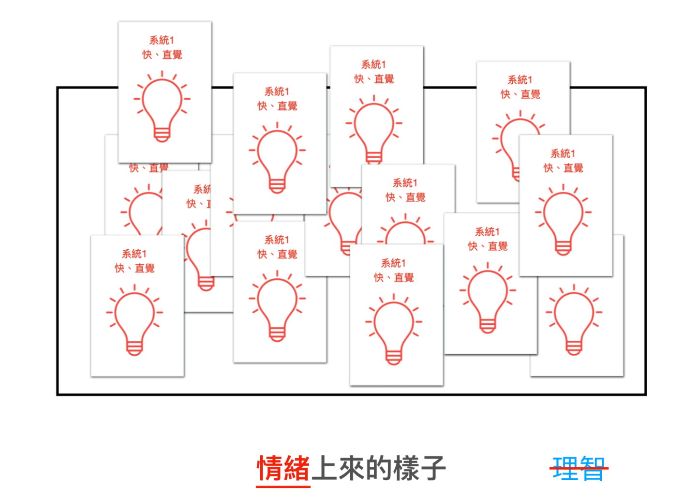
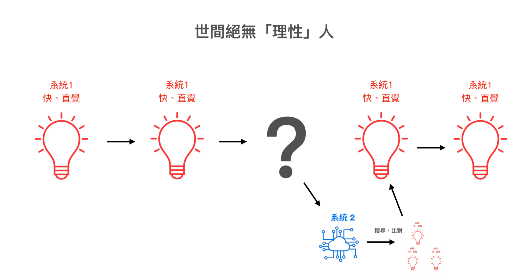
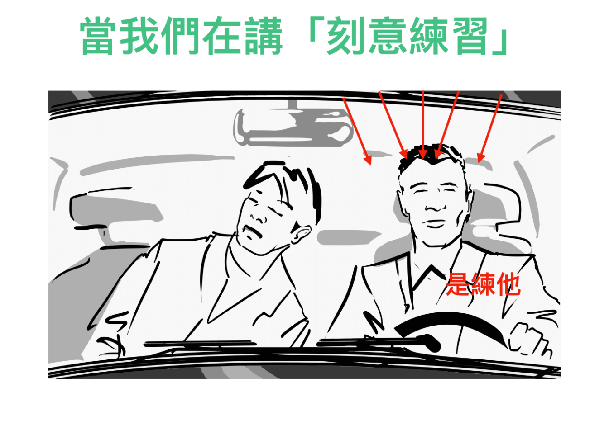

# 第四章 科学练记忆，谈「记住」与「学会」

关于学习这件事，许多人最担心的是学习之后，「记不起来」怎么办，特别是基础知识忘掉之后，搞得寸步难行。

也因此，市面上关于记忆术的文章一直很夯。

### 所谓的学习，我们到底在追求什么？

学完的东西记不住，一下就忘记了。我们要如何加强这个技能呢？

在继续深入谈这个话题之前，我想要先聊另外一个话题。

关于学习，我们到底求的是什么？

我想很多人的答案是：「记住」与「学会」

但是，我认为很多人在学习这个主题上，把「记住」与「学会」两件事混淆了。

常见的认知是以为用大脑「记住」了以后，就「学会」了。

实际上这两个动作顺序却是相反的。

而正确的顺序是，人类应当是「学会」了才会「记住」，而「记住」的未必「学得会」，是吧。

这句话看起来似乎有点道理，但是感觉有点绕。

让我再继续更深入叙述说明，这又必须从从长期记忆建构的原理开始讲起。

### 1. 大脑的记忆结构是网状搭建

我们常以为是记忆在大脑的构成是一点一点打上去，而大脑是一个容纳我们无限塞东西进去的大储物间。

但事实上大脑能够长期被记住的东西是一片「互连」「网」，你丢进去的资讯，会被黏在既有相关的网子上。或者是你经过刻意整理（笔记、领悟），将学到的东西组成一片自己的网子。

也就是说，最后：

- 有逻辑能够理解的事情才容易被记得住
- 有相关性的东西才会被记得住
- 有结构的东西才会被记得住

所以，一件事情当下你不明白、没有相关资讯的网子可以黏附、事后又没有整理，那么这个资讯瞬间就会被冲掉。

（这就是为什么故事比理论更容易被记住。因为，故事是一个有趣且更完整有组织的结构。）

### 2. 肌肉也能记忆东西

再者，我们往往以为只有大脑可以记东西，但实际上，身体也能记东西。

所谓身体的感觉记忆，原理是身体执行动作时，会给神经纤维带来脉冲。而髓鞘质所谓的记忆神经回路是电流脉冲传过神经纤维。髓鞘质是包裹在神经通路外侧的一层绝缘物质，当练习用到某部分神经通路时，这部分的髓鞘质就会生长起来。练习得越多，绝缘层越厚，通路中的信息传递速度就越快。这就是所谓的「肌肉记忆」的效果。

精确的来说，被用来记忆的东西并不是肌肉，而是神经束。你越练，身体上的电线，越练电线越粗，电线皮越厚。所以信号速度传的越快，而且越不容易被忘记。

### 3. 人脑会拼命遗忘

为什么我们会忘记一些不久之前上过的课、读过的书内容。有两个原因：

(1) 资讯冲刷

这是因为你可以想像，输入人脑的是无穷无尽的一束资讯流，我们暂存这道资讯流的空间有限。你又可以把这比喻为机器的 Log（记录当日每一起发生事件，但是暂存区满了，就会按照时间把旧的资讯推掉，只留下最近的）。

如果我们不在还在暂存区暂放的时间，将里面有用的资讯「整理」放回能够相对保存较久的储存空间，如大脑、神经束。

这些讯息就会被自动冲走

(2) 记忆失去连结

神经是网状连结。理论上当你把资料搬去这些储存较久的空间去存放时，保存时间可以比较久。但是，太久没存取，可能连往这一片的记忆的连结就断了。

你可能经历过一些类似情况。有一些技能或知识，某几年你真的很熟，但放在那里很久没用了，需要回想一阵子才能挖回来，但一挖回来之后又能熟练使用了。

### 大脑的记忆冷藏时间只有一天

在讲记忆法的相关书籍，有一个概念「**艾宾浩斯遗忘曲线」**经常被提起**。**

心理学家赫尔曼·艾宾浩斯通过自己的实验提出。在这一实验中，艾宾浩斯使用了一些毫无意义的字母组合。通过记忆这些字母组合，并在一系列时间间隔后检查遗忘率，得到了这一曲线。

- 20分后，42%被遗忘掉，58%被记住。
- 1小时后，56%被遗忘掉，44%被记住。
- 1天后，74%被遗忘掉，26%被记住。
- 1周后，77%被遗忘掉，23%被记住。
- 1个月后，79%被遗忘掉，21%被记住。

所以，通常研究记忆的学者。会希望我们读完书、上完课之后，要立刻复习，否则会容易忘记。

但其实只叙述「暂存区储存的时效问题」。

他们还少说了好几件事，如果你要把这些东西记起来：

* ㄧ、首先第一件事，这些资讯必须要「你在乎」，「在乎」的意思表示与你当前目标相关。
* 二、这些资讯要以一个网状结构才能储存。也就是
  - (1) 你能够理解当中的逻辑
  - (2) 可能用一个故事包裹著
  - (3) 这些资讯要与你的过去经历可以连结

所以，我们过去求学中，比较会教书，你也比较容易学会的老师，通常很会使用：故事、浅显比喻，甚至顺口溜。让你记得比较轻松。

### 我们将肌肉记忆的重要性低估了

学校教育有一个倾向，大大倾斜向「大脑记住」的重要性。至于「实验」「练习」课，这些课程，却容易被牺牲掉。

因为没有了「实验」「练习」课，学生也就没有办法体验到利用「实验」「练习」所带来的记忆美妙感。更甚至不知道「实验」、「练习」所带来的「肌肉记忆」的威力。

所以，多数人在这样长久的训练当中。会严重把「记住」与「学会」两件事混淆。以为「记住」过程就能够把一件事情学会了。实际上要「学会」一件事的标准，是重复操作一件事不失误。

但重复操作用的是肌肉不是大脑。而我更大胆的进一步说，把资讯记录在肌肉里面，反而可以突破大脑记忆被冲刷掉的存鲜时间限制。

### 谈脑记忆与肌肉记忆

为什么肌肉记忆可以远比大脑记忆更牢靠？

你是不是有类似这样的经历：

不管你是什么大学毕业的，在大学毕业前的课程，你几乎都忘光光还给老师了。但是，出社会以后学到的业务技能，大部分却蛮熟练的。记得很牢。

小时候喜欢的嗜好，比如说练跆拳道、踢足球、玩桌球、青年的时候组装电脑、玩射击游戏。长大后虽然会略微生疏，但手感通常却依然还在。

这是为什么呢？

### 陈叙性记忆与非陈述性记忆

历史上有个很有名的失忆症患者 H.M.。

1953年，他受了一项实验性精神外科手术，切除左右脑的部分海马回组织，企图减缓一直困扰他的癫痫。没想到手术后带来了无法想像的后果。这项手术造成他从此再也无法产生新的记忆。每天连跟谁说过话、吃过什么都记不得。

不过对于 H.M. 的这项悲剧，却对人类来说是个很好的赠礼。他同意了让一位神经科学家，在之后的几十年内，作为研究对象，探讨记忆的奥秘。

而针对 H.M. 最有趣的研究发现。他会忘记每天发生的各种事。虽然失去了记忆能力，但是却不会失去技能能力。

神经科学家将 H.M. 失去的这种长期记忆称之为**陈述性记忆**。而 H.M. 记得的有关动作技巧的长期记忆，称之为**非陈述性记忆**。

我「认为」这件事形容的并不精确。因为关于长期记忆，特别是「记忆」这个词，我们会认为，都储存在大脑里。

事实上，若按照刻意练习加粗电线的理论。

我认为长期记忆的运作应该是如下图的：

关于「事实性」「概念性」的知识，被存在大脑里，过了不久就被冲掉。

「程序性」知识则被存在神经里面，被髓鞘质保护起来。

这才能解释为什么我们会随著时间的衰退，会逐渐忘记陈述性记忆的知识。而练过的技能几乎很难忘记。

### 锻炼系统1而非系统2

当然，这只是我的假说。但后面我会证明为什么这个理论才是比较贴近现实的。

在丹尼尔‧康纳曼《快思慢想》这本书里面，有个著名的系统1与系统2理论。

指出人脑的运作机制分为系统1与系统2。

- 系统1代表是反射性直觉思考
- 系统2代表的是按部就班分析的理性思考。

而程序性知识储存调用的地方就是系统1，而概念、事实、元知识调用的地方在系统2。

在快思慢想里面这本书里面，指出了人类意识与行动，多由系统1直觉自动完成，系统2省电待机，只有在遇到难题与陌生环境时，系统2才会清醒改变决策。而系统2拥有最后的决定权。

「快思慢想」一书，提到系统 2 拥有最后的决定权。这样的说法好像乍有道理。

但是身为工程师，我却觉得这样的说法非常不合「计算机」设计的逻辑。

这是因为系统1决策执行的速度大约是15ms左右，但是系统2的速度要到500ms以上。

如果将这种速度画为系统图，人类应该长的是这样：

我们身体是由一系列的快速的小型子程序自动运作。

学术界有一个理论，是人类应是理性人（特别是金融、经济学都以此为假设），但实际上这可能完全非事实。

因为如果人类是理性人。那这整个系统，决策应该是多数系统2主导。但在通讯执行速度上，系统2是完全干不过系统1的。

于是在当人类情绪上来时，整个人会呈现这样的状态，理智下线。

人类甚至在急的时候，甚至会产生一个现象：「说话不过大脑」。

所以比较合理的情形，应该是：

人类平时都是以一个待机模式在运转，通常是遇到过去没有解决过的问题时，才会呼叫系统2出来搜寻判断可能解决的方法。

但所谓的理性，也只是慢下来，去搜寻过去可以快速解决的方案。

而人类本质上是一连串的无意识快速系统叠加组成，所以我们平时执行任务的时候。其实是由无数的系统1叠加串连组成结果。

当我们在讲人类多数是使用系统1在自动执行，系统2平常是在睡觉时。图其实是比较像这样的：

系统2根本不是主驾座位的那个人，而是在副座看到人家开车却误以为是自己开车。当遇到问题，才去踩1的煞车。

当我们讲刻意练习时，却很常会容易以为我们要练的是系统2。

事实上，我们却应该练的是系统1。

### 刻意练习的对象应该是程序性知识优先并写进系统1

在几年前，很多被传统教育荼毒的人，听到肌肉式学习这个字还会讪笑。觉得是义和团式的学习法。

实际上这个切入角度却是最科学无比的，而且反而容易深植持久的。因为人类本身就是由无数的小型子程序接续运行。甚至人体还会不断让子程序的回路，长得更健壮，分泌物质让回路保护层更厚。

所以在学习策略上。最正确的途径，应该是学习程序性知识为主架构（骨头），练习熟练后（且不容易忘），再吸收事实知识（做为肌肉）补充。

套用回来一般技能学习拜师的场景，就是：

1. 先跟老师不明就理的学习基础常见的流程
2. 当场做出成果后。回家短时间练三遍也重制成果三遍
3. 再针对你不懂的部分去补充基本知识。

而不是去背什么一大堆名词，最后再自己乱组句子，最后说不出一具完整的话。

因为，做为一个初学者，你是根本无法从事实性知识（名字）倒推出常见的基础流程（句子结构）与必要的有限正确知识（该在什么场景使用，细微的语气以及界系词）的。

所以，我才会反复的强调先习「流程性」知识的重要性。
