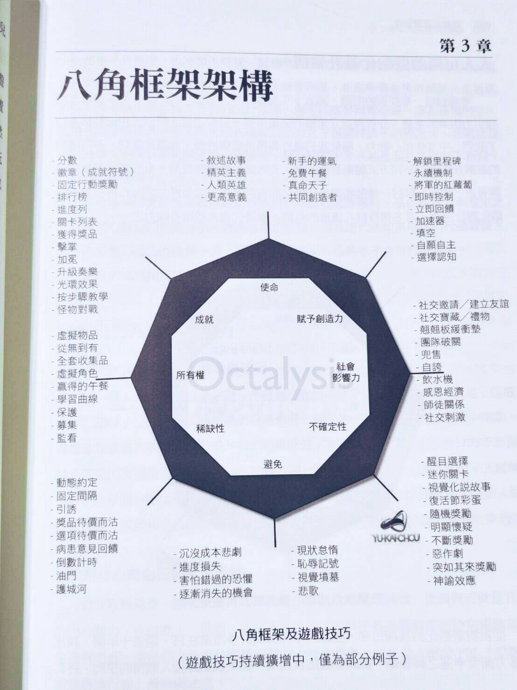

# 第七章 心流学习法「动机拆解篇」

成年人在讲学习时，多半讲的是效果：

- 跟职业人士一样流利
- 考试100分
- 速度超越其他人
- 找到工作
- 用技能取得我预想的成果

而且而且必须在短时间取得这些成效。

我相信大家都很 Enjoy 「当大神」「赢」的感觉。

也非常厌倦旧式教育那种读一堆细碎知识，却根本没有什么成果的学习法。

### 如何自学时成瘾

我们又提到了「自学」，本质上就是「自教」。也提到了成人的职业，是在比拼「程序性知识的效率」。还有「概念知识、元知识的存取纯熟度」。

所以本质上要快速学会一个技能，就是要对练技能产生上瘾，一直不断的练，才会变成高手。

但是，你又会想，这怎么可能？

练习，不是很痛苦。怎么可能会成瘾呢？

我在当程式设计师时，实际上是对编程成瘾的状态。但是我学其他学科时，也不一定每次都能进入这种状态。

所以我也在思考，如何人工造出可以进心流的框架，给自己用，也可以复制给别人用。

### 从游戏中挖掘心流与上瘾的关键

2017 时，我为了要打造一个高学成率的大规模线上编程课堂「全栈营」。为了这个问题十分苦恼。

如何让没有接触过编程的人，也能学编程上瘾呢？

但是我刚开始一直找不到入门砖。后来我发现这是因为在教育界，是很少对让学生成瘾有相关的文献的。因为「上瘾」在教育界是个负面字。指的是偏离主要轨道沉迷浪费时间。

如果有提到游戏，多半都是在讲如何穿插互动游戏，提高课堂间的短期专注力。但我要的不是短效专注药，而是长效专注药。

我后来转念一想，为何不转换领域，直接到游戏设计领域直接寻找呢？

对我来说「课程」或是「游戏」都是「缩略版的真实世界」。

但是游戏设计者对「上瘾」的态度可是很正面积极。毕竟游戏设计的其中一个目的就是为了让玩家成瘾在其中，无可自拔。

同样是缩略版真实世界。游戏为何可以大幅抢走学生的专注力，难道不会人觉得好奇吗？

于是我花了大量时间去研究这四个主题「习惯」、「心流」「成瘾」、「游戏化」，希望找到当中的设计关键。

### 心流

匈牙利的心理学者米哈里‧奇克森特米海伊（Mihaly Csikszentmihalyi）在《心流：高手都在研究的最优体验心理学》 一书提到进入心流状态有五个要素：

**（1）明确目标**

要达到心流体验，首先需要做一件有明确目标的事情，因为目标才会引领专注，才能让我们投入心力。

**（2）即时回馈**

即时回馈是达到心流的一个重点，为什么很多人会沉迷于游戏或赌博，就是游戏和赌博有即时回馈，做得如何，马上可以看到效果。

**（3）难度匹配**

难度匹配就是当今正在挑战的关卡，符合挑战者现在的程度。没有难度很快就会厌倦，但如果难度太高，又很容易放弃。所以，适当的难度才会激起参与者的持续投入。

**（4）全神贯注**

把潜在的外界干扰都摒除掉可以让你更快的进入心流状态，并且不易被打断。

**（5）持续挑战**

不但要匹配难度，而且要持续提供，让该项活动一直具有挑战，这也是刻意练习的核心。只有这样不断挑战，才能长期处于一种全情投入的心流状态。

### 上瘾

心流在学习界，往往指的是一个正面的词。指的是学习者进入一种浑然忘我的状态中，飞速学习。

而上瘾的表征，与心流很类似，但在学习界却是一种反面词。

> “成瘾”(Addiction)系指人对某种事物所产生的一种超乎寻常的嗜好和习惯， 这种嗜好和习惯透过刺激中枢神经的奖赏系统(reward system)造成兴奋或愉快感而形成“瘾”。至于“成瘾”则是指个体不可自制地反复渴求滥用某种物质或从事某种活动，虽然知道这样做会给自己或已经给自己带来各种不良后果，但仍然无法控制。

家长因为小孩玩游戏成瘾而荒废学业。所以家长往往见到学生对某一件事情上瘾了。就会强迫学生戒掉。

但在科学上。本质它们都是同样一件事。都是陷入对中枢神经的奖赏刺激系统循环，才会掉入了精神时光屋。

既然心流就是上瘾。

那么我们要如何打造进入心流/ 上瘾的状态。「心流」一书所提及的：

- （1）明确目标
- （2）即时回馈
- （3）难度匹配
- （4）全神贯注
- （5）持续挑战

在我的实践心得来说，我认为这应该只是「 心流」的「表征要素」。并不是真正的流程。

行为学家Nir Eyal 出了一本书Hooked （钩瘾效应）。当中叙述了人类上瘾的是怎么被人为制造的

> HOOKED = TRIGGER（制造契机） -> ACTION （进行动作）-> REWARD （得到奖赏）-> INVESTMENT（重新投资）

放一把火，骚起痒处，再提供解决方案，使用者得到奖赏后，促成某些行为。再利用这个行为，制造下个触发点的产生，以达到建造下个回路的结果。

「明确目标」「即时回馈」「难度匹配」是为了让人类维持在一个平稳的固定行为+奖励回圈里面，而「持续挑战」是这个行为的循环结果，「全神贯注」是参与者的心理状态。

所以「上瘾」本质上是什么？

上瘾= 「平稳的固定行为」+「奖励系统」。

更进一步的说，这个「平稳的固定行为」就是「习惯」。上瘾= 「习惯」+「奖励系统」。

你可以仔细想想，手游里面哪是什么「挑战」，我们将游戏解构以后，拿掉游戏情节以后，你会发现只是手在那里滑来滑去。你真正期待的是「那个内容物不一样的」「奖励宝箱」。

我们在前面学习的章节里面有提到过，叙述性记忆是很容被人类遗忘的。而重复性的程序性记忆（反复性的练习）会被人类的身体自动记住。

但是没有人会很无聊的反复练一个动作几十遍。这太无趣了。但是HOOK 到奖励系统上面就不一样了。

正确的奖励设计。不管再无聊的动作，你可能可以刷上一整晚。想想那些熬夜玩打电动的时光吧。

### 习惯

那么什么又是习惯呢？

习惯是大脑自动遵循的一些行为模式。我们每天的人生从一睁开眼睛就要面临著几百样选择。从到底要不要刷牙，该穿什么衣服，该穿什么鞋子，该走什么路线上班，上班该喝什么东西提神。

无一不需要做出选择。

但是如果大脑需要对生活中每样遇到的事，都得判断过一遍才能做出行动。那么甚至在踏出家门之前，你的大脑就会当机了。

所以我们大脑会将过去已经下过决策，而且体验还可以的记忆轨迹，建立起来变成「常规行为」，这件事就叫做「习惯」。

习惯都带有几个特征：

- 简单的动作
- 重复的动作
- 立即的正面反馈
- 平稳且轻快的情绪反馈(小确幸)

我在美国大师 Bob Pike 的课程设计课，里面学到了一个设计课程的犀利角度：

做课程要切分模块重要性。尽量将每个章节的长度缩到15 分钟之内（实体课）。

主要原因有几：

- 15 分钟是保持注意力的最佳长度
- 15 分钟也是这是留存学习内容的最佳长度
- 切分成小模块，难度容易控制调整
- 课程结构也很容易剪辑，前后调整

短且简单的课程，才能够非常容易植入「习惯设计」。

因为老师**不可能透过一个复杂的互动机制、情绪体验，让学生养成「习惯」这件事**。

很多人常会误以为，游戏化就是将游戏化的元素移植到课程里。

这仅仅只是了解字面上的意思。但将课程游戏化重点不是将游戏元素加入课程。

因为一个游戏不仅止于是具备游戏元素，就能够好玩。不然 Steam 上也不会有那么多不好玩的游戏了。

能够成瘾的长课程，设计重点应该是是如何将想教授的内容计成一个一个有目标、重复且容易上手的routine（固定动作）。

然后加入「奖励」以及「游戏化元素」（激励元素），让学生「有动力进入回圈」「能察觉到自己成长」最后「不自觉得寻求下一轮的重复以得到不同形式的奖励」。

听到这里。各位读者可能还是觉得这个应该只是假设，怎么可能把无聊的知识。包装成好玩的游戏。

接下来，我就实际拆解一个热门游戏，让大家知道它们是怎样做到的。这个游戏甚至可以把无聊简单的盖房子游戏，包装钓了玩家注意一个月之久。

## 拆解 2020 年最火爆游戏「动物森友会」设计上的秘密

2020 年 3 月底。因为 COVID-19 肆虐。待在家实在太无聊了。当时，任天堂刚推出一款新游戏「动物森友会」。大家也知道这款游戏当时销售有多火爆。游戏截图几乎刷满了整个 FB。买都买不到。

所以我也去预订了一款。没想到，这款本质上挺蠢的游戏，竟然钩住了我跟我妹两个人一整个月的注意力。

这个游戏本质上只是很简单的捉虫、钓鱼、装潢而已。我们两个竟然陷在里面不可自拔。最后，甚至还害我们买了三台 NDS（一人一台，多的一台全天后开机，作为生产原物料的岛）。

于是我就很好奇，任天堂这款游戏，到底是用了什么套路与动力，能够把玩家的魂勾的不要不要的。

**莫名其妙的让全球玩家成瘾**

动物森友会是一款非常神秘的游戏。

我对游戏成瘾很正常，我妹对游戏成瘾却很不正常。因为多好玩的游戏，对他来说都很花时间，而且过于复杂。

结果最后他却变得比我还沉迷这个游戏。

当初，这个游戏本来是我买的。到货的当天，我妹看我在玩，觉得这游戏还蛮简单智障的，加上当时我玩一会困了想睡午觉。于是就让他接手玩一下。

本来，他也只是拔拔草，钓钓鱼。没想到，我睡醒后，却风云变色。因为我妹觉得拔草钓鱼太有趣，于是他把整座岛可拔可钓的鱼都玩光了。

而且，甚至不愿意还我游戏机。

因为当时任天堂没有转移游戏记录的机制，于是我的任天堂就只能变成他的。我再买新一台。

接下来的一个月，我妹甚至与游戏机寸步不离。甚至有时候还一次开两台 Switch 种田。有这种症状的不只我妹。几乎在我 FB 墙上的许多朋友都沦陷了。

每个人都形容这款游戏有著魔法：「这个游戏本来觉得蛮智障的，就是打扫一个岛钓钓鱼而已，不知道为什么就陷下去了，每天准时起床帮黑心狸克打工」

黑心狸克到底有什么魔法呢？为什么这一个看起来弱智又剥削玩家免费打工还黑薪房贷的游戏，会让玩家上瘾到无法自拔。

就是我们接下来剖析透视的重点。

### **游戏动力篇（八角框架）**

在开始之前，我要推荐一本书，这本书的动力框架会贯穿后面章节的主要结构。

这本书就是 Actionable Gaminification 这本书。

在这本书中，作者周郁凯先生归纳出了一个人类动力框架「八角理论」。

人类去做某事的动力，基本上可以分成八种类别。

如果将这个八角分为上下两区。上面是白帽正面光明区，下面是黑帽黑暗区。

- 白帽是让人类感觉到强大、圆满、满意的动机元素。
- 而底下黑帽是让人类觉得著迷、焦虑、上瘾的元素。

一般来说：

- 黑帽的驱动力在短期比较强大。比如说被恐惧追逐或让你立即行动，看到有奖品会马上跳起来追逐，但是久了以后会无感。
- 白帽的驱动力在短期间无感，长期以来却会让你觉得自己在实现伟大事业，能够长久满足。

如果我们再将这个八角拆成左右两边。

- 左边的元素又比较偏向外在动机，与周遭比较。
- 右边的元素又比较偏内在动机，发自内心的驱动力。

动物森友会因为运用简单的元素，将里面的动力元素拿捏的非常好。所以这款本质上「幼稚无聊」的游戏，才让许多玩家严重成瘾，最后却玩到停不下来。

## 拆解动森套路（前五天）

动森的游戏真要分析，可以分析再往下拆成前五天与后五天的游戏进度。

游戏前五天会比较像是一个游戏的 Onboarding，也就是教玩家学会这款游戏的一个过程。

为什么是五天呢？其实我们在设计网站或游戏时，5 是一个很关键的数字。

如果你能让用户连续用 5 次。基本上后续他就会养成一个惯性。不太容易 drop 这个游戏。

所以动森的前五天其实是很关键的。

### 第一天：狸克骗你签房贷

在刚开始玩动森的第一天。动森里面其实是没什么任务的。但是当天结束，狸克很邪恶的骗了玩家签一个 9800 的房贷。

狸克为什么要骗用户签房贷呢？

这就是让用户先误以为他自己有一个目标。就是他欠了钱需要还。

否则如果来岛只有砍树与钓鱼的话，用户马上会觉得这是什么傻逼游戏，立刻就走了。

当然，第一天能玩的也是有限的。狸克交给玩家一个帐棚就叫玩家回家洗洗睡，明天再回来找他。

所以第一天虽然没什么内容，玩家还是会甘愿当作「好吧。被骗一天我还能接受，明天看你有什么说法」。

### 第二天：让任务有意义

当玩家第二天去找狸克时，他说他有一个朋友要来岛上住，还跟玩家说，他愿意用 500 的代价，代收购化石。因为此时玩家非常缺钱，拔草都没这么好赚，玩家当然想说这应该是有点意思。

不然谁要无偿每天拔草钓鱼挖化石。

等狸克收满了额度以后以后，他又开始掰个借口凹玩家，说正在帮馆长找博物馆地点。隔天会盖好。

虽然玩家觉得好像这游戏很无聊。但是已经答应要帮人盖博物馆了。就会想继续待一天看看，到底狸克还能搞出什么说法。

### 第三天：博物馆开张，原来可以搜集东西

博物馆馆长来了以后。发现突然有新东西可以玩了。就是收集。（所有权动力）

一般玩家有个犯贱心理，看到收集簿，会想要收大全集。

所以玩家就会开始很忙。到处钓鱼抓虫。

原本觉得这游戏很很智障，突然也觉得不智障了。还会想说哪里可以抓更多。

这时候机场与里程卷就有用了。

里程的门槛，也会刚好够让玩家出一次岛。

这里有个小设计就是每棵树可以砍三次。为什么砍三次呢？

因为可能会掉三种不一样的东西。这让玩家会觉得「不确定会掉什么」，就会一直砍一直砍。

钓鱼也是相同的原理。我妹妹就喜欢钓鱼远胜于抓虫。因为他十分享受可以钓出一种神秘大鱼的感觉。

而且我竟然也跟著著魔，为了能钓出更多的鱼。我竟多买了一台 Switch Lite 在家当作公用南半球，专拿来钓鱼用。

### 第四天：出岛交朋友

当玩家可以出岛以后，会开始发现有陌生的角色。他会想来搬来你的岛。

为了帮新玩家盖房。会意识到前几天囤的自家材料还真不够用阿....只好继续砍木材。

而这些新角色了以后，它们常常做出一些神秘的行为。比如说撩你、逗你、送你东西。

如此新奇（不确定性）会引诱玩家一直跟它们讲话互动。

同时这时候因为玩家开始发现有很奇怪的鱼、很奇怪的邻居。开始会将图片上传到 FB。

这时候就会一堆人问你这是什么，虚荣心简直是爆棚到极点（社会影响力）。

玩家就会觉得我家有动森我光荣。

### 第五天：盖自己的家

前几天，其实家里根本光凸凸的没啥好玩的。但是等玩家骗来三个岛民后。家里开始可以有一些家具可以选。玩家就会想要开始盖一点试看看。

然后这些家具都很机贼的需要铁矿。于是玩家出于无奈只好去农里程换券出岛去采矿。

至此玩家已经不知不觉得玩五天了。

这时候你觉得自己好穷人生，十分灰心，难道我要农一辈子吗？

### 第六天：曙光来了，卖大头菜的家伙出现

就当你觉得人生灰心时，突然有个卖大头菜的家伙来了。结果这家伙偷偷告诉你一条赚钱密技，就是炒大头菜期货可以暴富。

所以你半信半疑的把钱 all in 下去买他的菜。

接下来就过著提心吊胆的日子。这时候玩家已经不知不觉沦为动森里铃钱（金钱动力）的奴隶了。

因为大头菜周末就会烂。所以玩家必须在这六天把菜卖出去。菜价一天会报三次。所以逼得玩家一天会回来三次。。。。。。。（害怕失去的动力）

开始有没有那种邪恶的味道...........

原本都要弃玩了这贼游戏又把玩家绑了一周。

### 第七天：据说 KK 要来

但是第七天真是没事干。要找点事干阿。这时候狸克就说什么想要想让他的偶像 KK 上岛。

这时候你就好奇 KK 是谁？

但不管是谁。反正这岛要建设到一定 LEVEL 他才要来。

反正玩家也没事干，就开始盖。（其实 KK 是谁根本关我屁事）

然后盖著盖著，镇公所的西施惠就嫌你缺这缺那的。你只好就一直去凑花、装饰。

莫名其妙的也盖开始把这岛盖成有点形状了。

人类就是既然要盖就要盖完。这时候狸克就会推销玩家盖桥阿盖斜坡阿。

玩家身为岛主，这一定是你的事。（成就、使命、创造）

你一看草泥马一个基础建筑，最便宜又要 98000。只好继续打工赚钱。

而且到这里。几乎玩家都打工成惯性了。不可能在此时 quit。

## 限制机制（不让玩家玩「尽」游戏，导致中途放弃）

这里面有几个细部平衡机制。防止玩家过于辛勤破坏游戏性

### 1. 里程机制

基本上这游戏常常因为一些乱七八糟的机制或者是迷之不可说的机制，钱也没有那么不好拿。但是出岛一定要拿里程卷。里程卷只能农的。

这就保证玩家一定会乖乖会去做任务农里程。

无法作弊弊修改。而里程本身有时候绑一些用钱买不到的限定商品，只能用里程卷兑换。

### 2. 早上 5:00-22:00 的游戏时间

玩家过于辛勤，会提前把游戏玩「完」，停止游戏

所以基本上游戏设计了几个机制：

- 早上 5:00 才会有新故事进度
- 早上 9:00 商店才会开门，开到 22:00。其余时间八折收，而且晚一天才给钱降低玩家的周转率。很多玩家对于这个20%很计较（因为避免损失）。就会农的有所节制
- 申请盖房盖桥，都要隔天才会完工

我那段时间都乖乖晚上22:30 睡。早上 6:00 起来打游戏。简直健康到不行。

## 激励机制（勾起玩家无尽探索的欲望，产生变动奖励）

### 1. 点数 program

这是很厉害的机制。玩家每完成一些小任务。就会得到点数。或者掀开一张未知的成就卡。都是集点制。大概都是重复 3-5个动作就拿到。

这害玩家会不断的农下去。一个接一个的作。（成就）

### 2. 收集品

博物馆真是很厉害的机制。玩家会为了要填满自家博物馆的馆藏。天天坚持捕虫抓鱼挖化石。就是要把展厅填满。

后期，玩家还会发现原来会有 Set。日式家具、竹林、流星 set...etc

为了要把整套家具凑出来，又只好不停的农（稀有动力）

### 3. 特殊节日或活动

当你觉得游戏已经都是农不太好玩的时候。这时候又来一个节日。

比如说复活节或钓鱼大赛

害得玩家整天都在钓鱼凑钓鱼大奖。或者是存蛋存了一整个礼拜，存到都要吐了，换了一套复活节大全集。（所有权动力）（稀有动力）

### 4. 独特的岛

当你农到变成农夫之神时，KK 也来了。这时候就解锁了地形工具。可以盖河流、瀑布。甚至铺路。

你终于可以把当初那些畸形的地都铲光光，重新规划成你要的样子。（所有权动力）（创造动力）

这时候光整个岛整地铺路都市重划，还有光都市重划的钱，就要再凑一整个礼拜....

更不用说房子变大以后，还要找家具填满。简直是象牙筷子的烦恼。

特别是当你出岛以后，看到朋友的岛，再看看自己的岛，简直就土的像渣...........（社交动力）（创造动力）

## 精神时光屋的一个月

这就是为什么正常人能够注意力被动森圈住整整一个月的原因。

这打破我过去玩游戏的纪录。要知道我玩一个 3A 大作（荒野大镖客2）或 GTA5，游戏时间都不用两周就全破关了。

动物森友会最后竟然能让我整整玩了一个月，真是奇迹。其实不仅仅是「动物森友会」有这样的魔力。「勇者斗恶龙 创世小玩家2」也是类似的套论。

这两款游戏，看似是非常轻型的游戏，却却用巧妙的机制，却让玩家每天以极低的 effort 能够连续农一个岛浓了整整一个月。

说穿了真的很不可思议。

其实，相同的游戏机制，我们也可以把它移植到课程与自学上。

你不相信吗？让我下一章展示给你看如何做！
