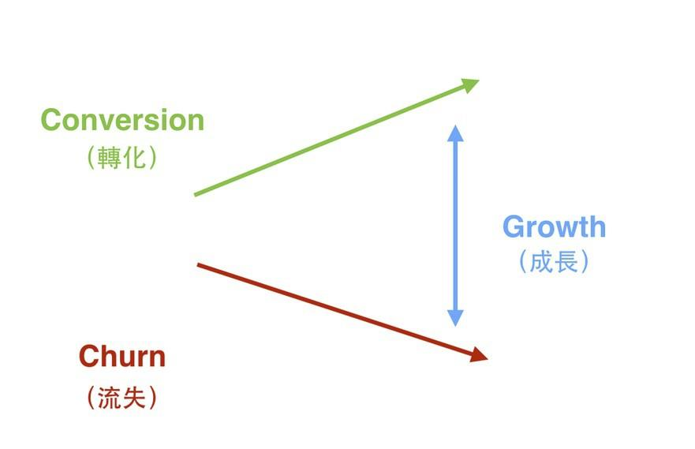
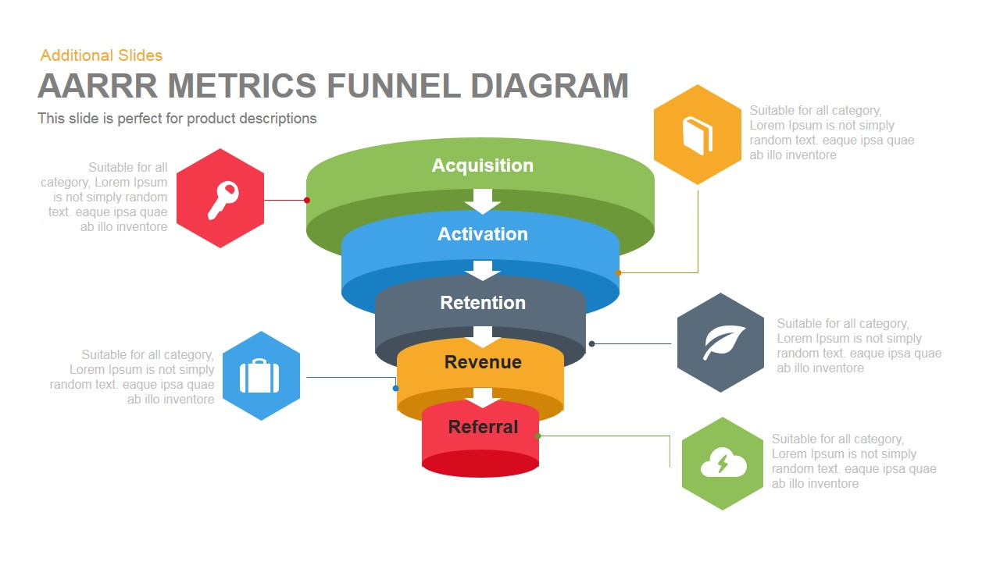
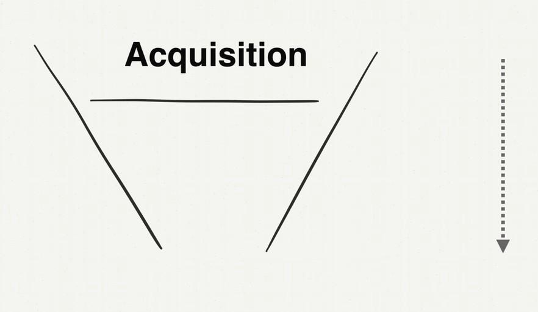
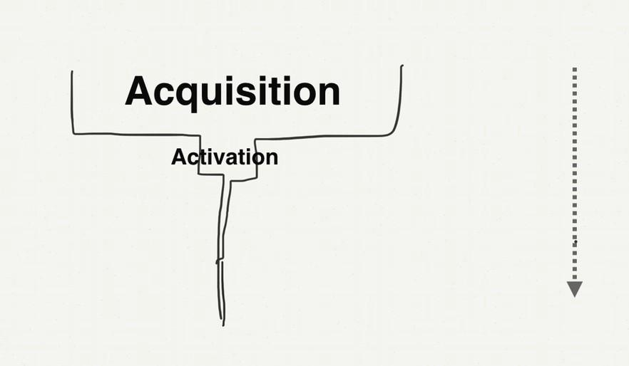
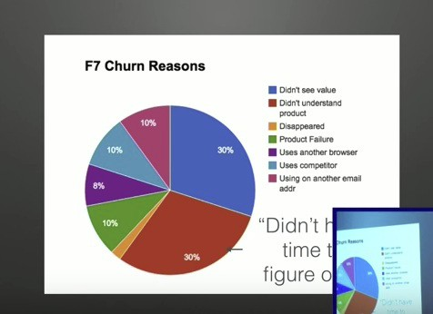

# 如何自学会一门学问

我们前面主要谈了几个主题：向老师学框架、从老师讲授的内容自己整理重点。

但是生活中并没有那么多好老师，又或者是那些好老师，与你时间、地点永不重合，你这辈子没机会上到他们的课。

又或者，这门学问技术太新，框架技术真实存在，但是可能到处散落在各领域。从各个来源（书、课程、文章）学习整理困难，感觉范围无限大怎么办？

有没有什么高效的方法。事实上还真的有，我就是靠著这套自学框架拿下多门领域的。

英文里的自学，实际上的英文词不是 "Self-Learning"，而是 "Self-Taught"（自教）

这里我要教会大家的就是一套「如何教会自己」的框架。

## 打造自己的「代数习题册」

2015 年，我在台湾有一门课 "Intro to Growth Hack" 在非常火红。Growth Hack 这个词翻成中文，叫增长黑客。是一门在网上用各种技术工具实现业绩增长的法门。因为这门课非常的新，当时在中文世界里没有太多材料，但又是一门大家趋之若鹜的技术。

2015 正值我当年从美国离职回台湾契机。技术圈朋友知道我在美国时有涉猎这门技术，希望作个分享。没想到这个课堂就被挤爆了。

原本第一个版本是只针对技术圈朋友分享的。专有名词很多。

后来在分享一两场之后，有个朋友问我，能不能将这门技术也改版成一般人也听得懂秒懂的课程，我试著尝试做了一个给一般人的ˊ版本。没想到从此教学之路就此点燃...。

因为当时这门学问又新又热门，而且当时我的这门课程又让人秒懂。即便当时我只懂讲述法，但也抵挡不了大家的热情。

最终这门课因为太火，一个月我得卖两次门票，一场收100人。每次放票在数分钟之内就被秒杀。半年之内听过这场演讲的人就足足有1500人次。

最后这本书还在一年后变成了一本书 "Growth Hack 这样做"，而这本书出版没多久之后，就拿下了金书奖。

为什么我能够在短时间（1-2年）把这门新学问研究的透彻又能够讲的浅显易懂呢？关键就在于我的拆题方法与笔记术。

在我的心目中，这个课跟我之前在大学写的「代数习题册」（让全班几什个同学代数考100分的攻略本）没两样。

早在 2013 年，我就在网上看到 Growth Hack 这个词了。也想学习，但是当时网上针对这门学问，根本找不到一本书有办法进行系统学习。翻来翻去都是一篇一篇语焉不详的英文文章。即便当时有一些行销人士，做了 Growth Hack 的网课，我也觉得品质很烂，根本没有回答到我内心想要知道的问题。

于是身为一个工程师。就打算自己研究这门学问。

毕竟，多数野生程序员，几乎都是自学成才学会编程的。而且编程世界绝大多数问题，很多都是崭新且实时发展并没有太多书籍的。我们多半都也是借由一篇一篇的文章，粹取重点，反复实做，应用在日常工作中累积出能力的。

在打造超人大脑这本书里面，我也分享我怎么从零学财报分析这门课的过程。这本书，我会利用 Growth Hack 这个主题，再演示一遍。

方法步骤是：

### **Step 1：写下你对这个领域所有的好奇与困惑点(什么是？与为什么这很重要？)**

当时，最原始基本的第1个问题，就是「Growth 到底是什么？」

我找了很多基本的资料，交叉重叠看。在 Stanford 的 2014 版 How to Start a Startup 创业课里面，听到课程谈到了 Growth 最基础的概念。（也是身为新手的我，我觉得最合理最画龙点睛的解释）

> Conversion（转化） - Churn（流失）=Growth（成长）

指出了增长 Growth 其实并非是单指业绩增长，而是指改进两个方向：

1. 增进转换率（促进陌生客人下单率）
2. 降低流失率（降低客人流失）

这个解释我非常能接受。因为我本来以为 Growth 的字面意思就是增长，没想到也要降低流失率也是重点。

接下来，我对这门领域的第2个问题，就是那「Growth Hack 到底是什么」？

我在维基百科上找到了答案：

> Growth Hack（成长骇客）根据Wikipedia（维基百科）上的定义，可以简单翻译如下：「技术创业型团队，通过数据分析和量化指标，来推广产品时所使用的一种市场营运技术」。

用白话文翻译，就是

> 在网上做行销很难，不像实体店铺一样，可以实体拉拢客户，可以看到客户逛商品的反应，为什么不想挑了离开走人，也能追问。但是在网上开店，这些事情都做不到，所以我们要用技术手段去监测客户行为，在客户有疑问时帮助他能够找到想买的商品，解决来店时就有的疑惑。也能侦测自己店铺上有什么跳出（导致客户离开）的问题。

也就是平日在店里面做生意相对比较容易，客人买不买你很快知道，也有办法当场处理原因。但开一个网店，这些动作就非常困难。我们需要学习一门技术能够应用在网店上，监视销售业绩，而且不管是增进业绩或者是降低客人流失都要能够自动化，并且大规模部属。

### **Step 2：找到最常出现的关键字或场景（这表示这是这门学问的关键骨干）**

围绕著 Growth Hack 去搜寻，有一组词 AARRR 一直不断的出现。

于是我去查了 **「AARRR 到底是什么？」**

我发现 AARRR 的意思是指顾客消费生命周期的五个阶段：

> Acquisition（用户获取）Activation (用户激活）Retention（用户留存）Revenue（扩大营收）Referral（推荐使用）

接著，下一个问题就是，**为什么知道「AARRR」这么重要？**

我看了很多文章以后，发现了原来我们一般做行销时，原本对 AARRR 的想像是这样，以为花大钱洒了广告费，客户就会进来：

但实际做生意时，会发生这样的事。花了大钱打广告，客户却不买单，也没有复购率：

所以我们才要花时间去改善这个问题，而 Growth Hack 就是在网站上改善这个问题的技术。

问题来了。**我们要如何做到？**

### **Step 3：XX 是什么？为何重要？如何做到？如何快10倍做到？**

所以接下来，我针对 AARRR 这五个环节，又各自提出了相同的问题循环：

### **Acquisition**

- 什么是「Acquisition」？
- 为什么「Acquisition」很重要？
- 如何做「Acquisition」？
- 如何比第一次做「Acquisition」更快上很多倍？

### **Activation**

- 什么是「Activation」？
- 为什么「Activation」很重要？
- 如何做「Activation」？
- 如何比第一次做「Activation」更快上很多倍？

### **Retention**

- 什么是「Retention」？
- 为什么「Retention」很重要？
- 如何做「Retention」？
- 如何比第一次做「Retention」更快上很多倍？

### **Revenue**

- 什么是「Revenue」？
- 为什么「Revenue」很重要？
- 如何做「Revenue」？
- 如何比第一次做「Revenue」更快上很多倍？

### **Referral**

- 什么是「Referral」？
- 为什么「Referral」很重要？
- 如何做「Referral」？
- 如何比第一次做「Referral」更快上很多倍？

## **Step 3：太难的主题先跳过**

我在网上经过一番搜索与研究之后。发现了

「Acquisition」与 「Revenue」这两个主题非常难简单的研究与总结。

前者「Acquisition」涉及到各个广告渠道的特性与投放。后者「Revenue」涉及到价格定位设计。

都是超级大的学问。钻研下去我就迷路了。

于是我直接放弃。先去钻研有限大的主题：

- Activation (用户激活）
- Retention （用户留存）
- Referral（推荐使用）

说是有限大，其实这三个主题也很不小。

只是这三个主题，有明确的范围、系统化工具、方法论。

再经过一番搜寻与研究以后，我发现：

- Activation (用户激活），我可以用 Landing Page 解决
- Retention （用户留存），本质上我可以用 Onboarding 这个概念解决
- Referral（推荐使用），可以用 NPS 这个工具 Debug 客户满意度与推荐指数。

搞定这三个主题，整个 Growth Hack 的核心架构就差不多弄通了。

至于 Acquisition 与 Revenue 的问题，可以用钱、外部力量去解决。

所以我集中火力，想办法把这三个主题，「如何做」的程序式知识找出来，想办法至少练上一两遍。

## **Step4: 找到快 10 倍的作法**

我还记得我刚学会 Landing Page 的这个工具时，在公司就足足跟同事开会、辩论、实做，足足搞了一个月。搞到最后老板都嫌怎么回事。要做一个页面怎么要拖上一个月这么久。

殊不知 Landing Page 牵涉到品牌定位，客户核心痛点的问题。

有时候，企业走著走著就迷路了，新进的员工根本不知道这间公司原本要解决什么问题，现在最强的又是解决什么问题。

一些程序员与设计师，在做网站时只在乎页面是否好看，根本不在乎网页上写的字是否能提高购买率，直击用户痛点，吸引下单。

但是，总不能每次做 Landing Page 都这样大战一个月。我们还有其他 Landing Page 要做。于是我就在研究，有没有做 Landing Page，更快的方式。Landing Page 的原理到底是什么。

后来真让我去琢磨出一个 Landing Page 快速写作框架。（作法请见「闪电式开发」一书）

我做一个 Landing Page 的时间从一个月，降到两周，降到两天，降到两小时。

## **Step 5: 弄懂底层的原理**

再来又要提到 Retention 这门学问。留下用户并且产生复购行为，是非常难的一门学问。

我买了几十本讲复购的书，每一本书都跟我说要以客为尊，就能产生复购。

这不他妈的等于废话吗？

我本来以为就此陷入死胡同。

**顾客是因为不知道如何操作、没有感受到价值才离开**

后来，我在硅谷大师 Brian Balfour 的一篇博客文章，提到他当年在 Hubspot 做产品时的一篇数据。提到一个血淋淋的数据：

- 30%的人是对这个产品「没有感受到价值」而离开
- 30% 的人是对这个产品「不知道怎么操作」而离开
- 10% 的人是因为「product failure」而离开
- 只有10%的人是觉得其他竞争对手比较好才离开

我才发现，原来客户离开最直接的问题，是

> 60% 的人不懂这个产品，进而没有感受到价值所以才离开。

### **Retention 的关键在于建立客户习惯**

我在研究 Retenion 这门学问的时候，另外一个关键字又在我的搜寻结果，不断的跳出来。

这个字叫「习惯」。

> 要让客户复购，就要让客户养成消费习惯！

看到这个领悟，你不又觉得这不又是另一句他妈的废话吗？

但是却触动了我的另外一个经验。

当时，我正在矽谷一间做十分钟内送上门的便当外送公司。有一阵子销售遇到瓶颈，我们的 Data Team 就派一群 Intern 去访问客户：问问客户，有什么是我们得优先改善的？

结果答案十分让我们震惊，客户对我们的服务有一大堆抱怨：

- 不好吃
- 速度太慢
- 司机送餐态度恶劣

…etc. 听完这些抱怨，我们羞愧到想自杀。

但是，这些客户竟然还愿意继续用。我们就非常疑问：为什么？

Intern 说：因为这些用户已经习惯了，因为这个服务非常便利：

- 虽然广告宣称 10 分钟到，但是，客户内心预期都是最晚 30 分钟内能到就可以了。
- 虽然不是什么可口的便当，但是「能吃」。以 10 块钱的餐，这样的品质可以了。
- 客户内心有一个最差的预期，只要产品还活在这条底线之上就行了。

后来，我们内部在捞数据时，发现我们所有的常客，只要在两周内有连续 5 次以上的消费记录，这个人就很有可能成为我们的常客。于是，我们就做了一档行销活动，叫 5by5 ，活动内容是这样的：第一单半价（5 元），只要你消费了，就再给你一张半价券。连续五次以内都试办价。

本来 RD Team 对于这个策略半信半疑。但是，我们服务品质什么都没改，且只做了这档活动，销售成绩就飙上去了。

由这个例子，我发现Retention 的重点，真是建立客户心里的预期，养成客户的习惯。

甚至自己的服务在短时间，无法提升品质。还可以这样做：让客户觉得烂得有 Pattern ，一切都按照他的心里预期。如果这段过程当中有一段让他觉得做得特别得好，超乎意外的好。客户就会觉得很开心，想要重复这件事情。连续几次都是这样，顾客就会觉得你的产品是超乎想像的好。

## **Step 6: 从别的行业改良移植现成的框架方法**

Retention 的底层原理我大概搞明白了，关键之处就在于：

- 让顾客一开始就知道如何使用，进而感受到价值
- 让顾客建立消费习惯

但问题是，怎么做阿？

这个问题我真是想破头，我在网上 Google "Retention" 与 "Onboarding" 这两个字都没有找到有用的方法。

让我感到非常的烦躁。尤其是搜寻 "Onboarding"，还跳出一堆我不需要的内容。都是 HR 行业的搜寻结果。

Google 找不到资讯这么挫折的事，对我还是很少见。于是我就在思考，为何跳出来的都是 HR 领域的搜寻结果。

才发现原来 "Onboarding"（上船），这个字，本身意思就是「新用户、新顾客引导」。而且这个字，就是从 HR 领域「借来」的。这个字本来是用来指「新员工引导」的。

我大拍脑门对阿。我在笨什么。没有什么行业比 HR 领域，更注重留下新人的。

因为企业招募到一个合适的员工，要花上很多招聘成本，而且如果新人不适应，很快就走，招聘成本就丢到水里面了。如果新人一直无法适应新环境，产生不了认同，学会不了基本知识，无法上手业务。对公司是巨大损失。

于是我就上 Amazon 买了几本 Onboarding 的书，果然在 Onboarding 的书里面找到参考方法。我后来自己发明的 Onboarding 框架就是参考了几本讲员工入职的书，改编而成做出的框架。

这个 Onboarding 框架也被我应用到各大领域，是一个快速让新人融入陌生环境的厉害方法。

特别在做网站领域，刚上去没有明显的错误。但是就是用上去不称手。但是总要叠代个半年一年才摸索出使用者习惯。此时已经不知道流失掉多少客户了。

我们用了这个方法后，甚至可以在上线前，就针对使用者动线，打磨到丝滑般的体验。

## **「自教」的框架**

这章其实就是：

1. 写下自己对这个领域所有的好奇与困惑点
2. Google 或买很多书，满足这些好奇、疑惑。找到一直重复出现的重要关键词与领域结构。
3. 找到实做的方法（程序性知识）。
4. 摸清楚底层原理（补充事实与概念性知识）。
5. 重新设计出快10倍效率的方法与框架（后设认知调整自己的作法）。
6. 反复进行这个循

的具体展示方法而已。

当初许多朋友会 "Intro to Growth Hack" 这堂课容易理解、书也非常好懂。其实就是我在研究时，写来「教会」我自己的一本笔记。

而我这本「打造超人学习」更是我为自己打造的一个超大「学习」框架。
